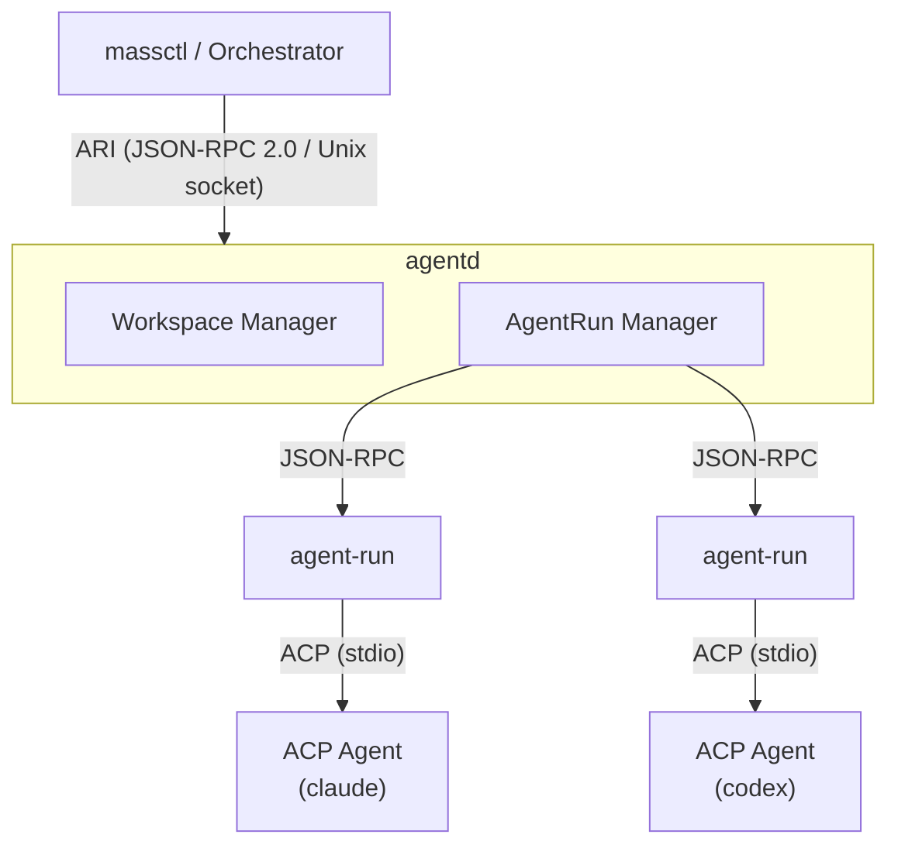

<div align="center">

```
 ███╗   ███╗ █████╗ ███████╗███████╗
 ████╗ ████║██╔══██╗██╔════╝██╔════╝
 ██╔████╔██║███████║███████╗███████╗
 ██║╚██╔╝██║██╔══██║╚════██║╚════██║
 ██║ ╚═╝ ██║██║  ██║███████║███████║
 ╚═╝     ╚═╝╚═╝  ╚═╝╚══════╝╚══════╝
```

### Multi-Agent Supervision System

*An OCI-inspired runtime for AI agent lifecycle management.*

[](https://go.dev)
[](docs/design/README.md)
[](https://www.jsonrpc.org)

---

**Create** · **Supervise** · **Recover** · **Scale**

</div>

## What You Get

<table>
<tr>
<td>🔌 <b>Agent as a Service</b></td>
<td>Run any AI agent as a <b>supervised, long-running process</b> without a terminal.</td>
</tr>
<tr>
<td>🧩 <b>Any Agent, One Interface</b></td>
<td>Speaks <a href="https://agentclientprotocol.com"><b>ACP</b></a> (Agent Client Protocol). Claude Code, Codex, or any ACP-compatible agent — <b>no vendor lock-in</b>.</td>
</tr>
<tr>
<td>👁️ <b>Observable, Interactive, Async</b></td>
<td><b>Typed event stream</b> for every agent. Connect via <b>TUI</b> (<code>massctl agentrun chat</code>) anytime — chat, browse diffs, send a task, walk away, come back for results. <b>Replay</b> from any point.</td>
</tr>
<tr>
<td>📂 <b>Shared Workspace</b></td>
<td>Multiple agents work in the <b>same workspace</b> (git / local / emptyDir). <b>Ref-counted</b> lifecycle, automatic cleanup.</td>
</tr>
<tr>
<td>⚡ <b>CLI + JSON-RPC</b></td>
<td><code>massctl</code> CLI for daily use. Full <b>JSON-RPC 2.0 API</b> (ARI) for orchestrators, CI pipelines, or custom UIs.</td>
</tr>
</table>

---

## What is MASS?

**M**ulti-**A**gent **S**upervision **S**ystem — manages AI coding agents the way **containerd manages containers**. Not a framework. Not an SDK. A **supervision system** with clean layering, spec-driven contracts, and recovery built into the foundation.

MASS borrows the battle-tested architecture of the [OCI](https://opencontainers.org/) container ecosystem and maps it directly onto the agent domain:

```
OCI (Containers)                    MASS (Agents)
─────────────────                   ─────────────────
runc + containerd-shim         →    agent-run
containerd                     →    agentd
CRI (Container Runtime Interface)→  ARI (Agent Runtime Interface)
OCI Runtime Spec               →    MASS Runtime Spec
OCI Image Spec                 →    MASS Workspace Spec
crictl                         →    massctl
```

> Containers solved a structurally isomorphic problem: how to standardize describing, preparing, and executing isolated workloads. Agents face the same layered concerns — minus the kernel isolation.

### Architecture



The diagram shows three layers: **client → daemon → runtime**. Each layer communicates via JSON-RPC.

**Data Models**

| Concept | Description |
|---------|-------------|
| **Agent** | Reusable template defining how to launch an agent process (command, args, env). Register once, use across workspaces. |
| **Workspace** | Prepared working directory (git clone, local mount, or empty scratch) shared by one or more agent runs. |
| **AgentRun** | Running instance of an Agent within a Workspace. Supervised process with its own lifecycle (`creating → idle → running → stopped`). |

**Components**

| Concept | Description |
|---------|-------------|
| **agentd** | The daemon (analogous to `containerd`). Manages workspaces, forks/watches/recovers agent-run processes, and exposes the ARI API. |
| **agent-run** | The low-level runtime process (analogous to `runc`). Manages a single agent process, holds the ACP stdio connection, and translates protocol events. |
| **massctl** | CLI client (analogous to `crictl`). All operations go through ARI. |

**Protocols**

| Concept | Description |
|---------|-------------|
| **ARI** | Agent Runtime Interface — JSON-RPC 2.0 over Unix socket. The control plane API between massctl/orchestrator and agentd. |
| **agent-run RPC** | JSON-RPC between agentd and each agent-run process. Used for lifecycle management and session control. |
| **ACP** | [Agent Client Protocol](https://agentclientprotocol.com) — JSON-RPC over stdio between agent-run and the actual AI agent process. |

### Built-in Agents

MASS ships with three built-in agent definitions. All agents communicate via [ACP](https://github.com/coder/acp-go-sdk) over stdio and require [Bun](https://bun.sh) (`bunx`) to launch:

| Agent | ACP Adapter | Status |
|-------|-------------|--------|
| **claude** | [`@agentclientprotocol/claude-agent-acp`](https://github.com/anthropics/claude-code/tree/main/packages/claude-agent-acp) | Enabled |
| **codex** | [`@zed-industries/codex-acp`](https://github.com/zed-industries/codex-acp) | Enabled |
| **gsd-pi** | [`gsd-pi-acp`](https://github.com/zoumo/gsd-pi-acp) | **Disabled** by default |


## Installation

**Prerequisites**

- [Go 1.26+](https://go.dev) — to build MASS
- [ACP-compatible agent](https://agentclientprotocol.com/get-started/agents) — at least one agent to run. Built-in agents (claude, codex, gsd-pi) require [Bun](https://bun.sh) or [Node.js](https://nodejs.org).

```bash
make build
# Produces: bin/mass (daemon + agent-run) and bin/massctl (CLI)
```

## Quick Start

```bash
# 1. Start the daemon
mass daemon start

# 2. In another terminal — launch a claude agent in the current directory
#    -w sets the workspace name, --agent picks a built-in agent definition
massctl compose run -w my-project --agent claude

# 3. Send a prompt and wait for the response
massctl agentrun prompt claude -w my-project --text "explain this repo" --wait

# 4. Or open the interactive TUI to chat, view diffs, and monitor in real-time
massctl agentrun chat claude -w my-project

# 5. When done, stop the agent run and clean up
massctl agentrun stop claude -w my-project
massctl workspace delete my-project
```

For declarative workflows, use `compose apply` with a YAML spec instead of imperative commands.

## CLI Overview

**`mass`** — the daemon binary.

| Command | Description |
|---------|-------------|
| `mass daemon start` | Start the MASS daemon |
| `mass daemon restart` | Restart the running daemon (SIGHUP → re-exec) |
| `mass daemon status` | Check daemon health |
| `mass run` | Directly spawn an agent-run process (low-level) |

**`massctl`** — the CLI client. All operations go through ARI.

| Command | Description |
|---------|-------------|
| `massctl compose run` | Quick-start a single agent in the current directory |
| `massctl compose apply` | Declarative workspace + agent-run management via YAML |
| `massctl workspace {create,get,delete}` | Manage workspaces |
| `massctl agent {apply,get,delete}` | Manage agent definitions |
| `massctl agentrun {create,get,stop,restart,delete}` | Agent-run lifecycle |
| `massctl agentrun prompt` | Send a prompt to a running agent (`--wait` for response) |
| `massctl agentrun chat` | Interactive TUI — chat, view diffs, replay events |

## Tech Stack

| Layer | Technology |
|-------|-----------|
| Language | Go 1.26+ |
| RPC | JSON-RPC 2.0 (`sourcegraph/jsonrpc2`) |
| Storage | bbolt (embedded key-value) |
| Agent Protocol | ACP (JSON-RPC over stdio) |

## Documentation

- **[Design Specs](docs/design/README.md)** — Architecture overview, OCI mapping, all spec documents
- **[Architecture](docs/ARCHITECTURE.md)** — Component map, data flow, package layout
- **[Development Guide](docs/develop/)** — Code principles, contribution rules, development references
- **[Decisions](.gsd/DECISIONS.md)** — Architectural decision records (D001–D112+)

## Acknowledgments

MASS's interactive TUI (diff view, chat interface) incorporates code from [Charmbracelet's Crush](https://github.com/charmbracelet/crush) — a beautifully designed terminal UI toolkit. The vendored subset lives in `third_party/charmbracelet/crush/` under the [FSL-1.1-MIT](third_party/charmbracelet/crush/LICENSE.md) license (converts to MIT two years after release). See [NOTICE](NOTICE) for details.

Thanks to the [Charmbracelet](https://github.com/charmbracelet) team for building excellent TUI components that make terminal applications a joy to use.

## License

This project is licensed under the [Apache License 2.0](LICENSE).

> **Note:** Third-party code under `third_party/` may use different licenses. See [NOTICE](NOTICE) for details.

---

<div align="center">

*Built with the belief that AI agents deserve the same operational rigor as containers.*

**MASS** — because managing agents shouldn't be harder than managing containers.

</div>
